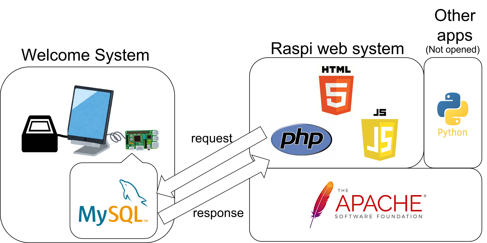

# Welcome System
## 概要
本システムは、研究室等で利用することのできる入退室管理システムです。
Raspi_web_system(URL: https://github.com/mozyomo/raspi_web_systrem)と合わせて使用することで、現在、誰が研究室内に在室しているのか、また、
いつ入室・退室したのかが分かるようになっています。
## 動作環境
当システムはRaspberry Pi4上での動作を前提としています。
また、完全な動作のためには、タッチパネル、バーコードリーダーなどのハードウェアが必要になる場合があります。
## その他環境
・MySQL
## 使用方法
Raspberry Pi4に当リポジトリーをクローンした後、ターミナルに以下のコマンドを入力してください。
```
$ cd /path/to/welcome_system
$ python main.py
```
## システム構成図
 

## 今後のアップデート予定
1. タッチ操作において、日本語入力に対応するため、raspberry pi用の仮想キーボード(日本語)の開発
2. これまでの入室記録を参照し、解析することで次回退出時に入室した部屋を自動でサジェストする機能を搭載
3. GUI画面の改良

